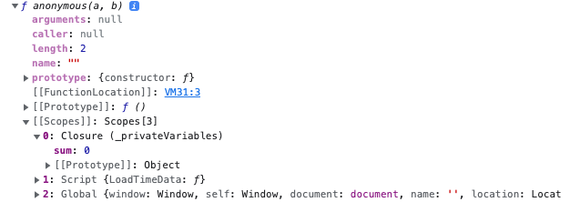

## Introduction

You can't directly create private properties, but if you use classes you can now create them with one symbol. However, this blog is not targeted to use only one way to declare them. We will discuss different methods to achieve and when to use what.

### Scoped Variables

Scoping is one of the most important aspects of Javascript to understand how things work behind the scene. Although this blog won't include details about the different scopes in JS, it is important to understand them. 

So, you should understand the scope before reading the scope variable ([here](https://blog.bitsrc.io/understanding-scope-and-scope-chain-in-javascript-f6637978cf53)).

Let's take an example to understand it. We have a function area and it gives us the calculated area.

```
function area (width, breadth) {
    this.width = width;
    this.breadth = breadth;
    this.areaCalculate = function () {
        return this.breadth * this.width;
    }
}
const areaRec = new area(10, 20);
console.log(areaRec.areaCalculate()); // 200

areaRec.width = 20; // able to change th width
console.log(areaRec.areaCalculate()); // 400
```

Now, the above function is fine and it can calculate the area well with no errors or anything. However, you can update the properties on the `areaRec` object and calculate with different `width` and `breadth`. 

**How to make the width and breadth properties private so you can't modify it ?**

```
function area (width, breadth) {
    return function () {
        const wtd = width;
        const brdh = breadth;
        return wtd * brdh;
    }
}

const areaSquare = new area(10, 10)();
console.log(areaSquare); // 100;

areaSquare.width // undefined;
```

So, now `width` and `breadth` are private to the instance we create.  This way you can create multiple private properties, you can also use getter setter way to achieve this.

### Symbols
Symbols are a new primitive type added in JS, you may know it already and use it. It helps to create some sort of private property, but not exactly private. They are private to the objects i.e they are not enumerable. Let's see what I am trying to say:

```
const sym1 = Symbol('Sort Of Private Properties');
const testObj = {
    [sym1]: 'Private Properties',
    name: 'Symbols'
}
console.log(testObj) // {name: 'Symbols', Symbol(Sort Of Private Properties): 'Private Properties'}
console.log(testObj[sym1]) // 'Private Properties'
```

When you print `testObj`, you will be able to see it. If you know the symbol, you can access it on the object and what if you don't know it exists? We use `Object.keys(testObj)` to get all the keys.

```
Object.keys(testObj); // ['name'];

Object.getOwnPropertySymbol(testObj) // [Symbol(Sort Of Private Properties)]
```

So, the `symbol` properties are not given by `Object.keys` as they are not enumerable. It sorts of creates the hidden properties on objects instead of a private one.

### Closures

One of the most asked questions in the interview. One of the scariest features of JS, Is It? Yes, kind of, but once you get it I believe you will feel comfortable, I won't say you become master (I want to change this perspective though). 

Unknowingly, many of us have used it, but we don't know about it. So, without wasting much time let's start.

**A closure is the combination of a function bundled together(enclosed) with references to its surrounding state(the lexical environment)**

OMG! what is it? So, In simple terms, a closure gives you access to an outer function's scope from an inner function (this sounds better any day).

It is a wide topic to understand and I believe I can write one blog for it, but at the moment we will understand how to use closure to create private variables.

```
function _privateVariables() {
        let sum = 0;
        return function (a, b) {
            sum = a+b;
            return sum;
        }
}

console.dir(_privateVariables()); // see the image below
```


You can clearly see in the image that we have different scopes created in the function, at the moment we will only discuss about the closure scope. 

We see `sum = 0` in the closure scope as it is being used by the inner function, but what if we don't have closure? Of course, there will be a reference error.

#### In-depth working

```
function _privateVariables() {
        let sum = 0;
        return function (a, b) {
            sum = a+b;
            return sum;
        }
}

const inner = _privateVariables();
console.log(inner(10, 30)); // 40
```

When the above code snippet executes, prints `40` i.e sum = 40. Here scope refers to the current execution scope (i.e what is currently being executed on the stack). Let's see step by step:

- The function `_privateVariables()` will be pushed to the stack and executed (simple shorter version);
- At this time when the inner function is returned the closure scope is created and returned
- Now, when the interpreter reaches `inner(10, 30)` push it to stack and execute it
- The addition of `a+b` will be assigned to sum and it is first checked in function scope if not found then in the scopes
- So, the sum is present in the scope under closure then its value will be read and assigned the new value and returned

It seems a lot is going on, but this is what happens every time we create a closure and **it is only created when you return the function that has the variable-value bindings that existed in returned function**


### ES6 Class syntax

ES6 class has been introduced along back now, but new features are being added in every release. However, `private class variable` was released in ES2020 though there are a few people who are still using or aware of it.

```
class PrivateVariable {
    #i_Am_Private = 'version_1'
    constructor() {
        this.name = "avtechstand";
    }

    get #version() {
        return this.#i_Am_Private
    }

    get version_Public() {
        return this.#i_Am_Private
    }
}

const pv = new PrivateVariable();
console.log(pv.name) // "avtechstand"
console.log(pv.#version)); // Syntax Error
console.log(pv.version_Public); // "version_1"
```

Those who don't use class and use a lot of private variables can start using es6 classes much cleaner and easier to use. The only thing to make a private variable is to use `#` in front of the variable and it is considered private.


### Interview Questions

1) what will be the o/p?

```
let count = 0;
(function selfInvokingFunc() {
  if (count === 0) {
    let count = 1;
    console.log(count); // o/p
  }
  console.log(count); // o/p
})();
```

The o/p will be `1 and 0`. The first log will take the value of the count from its immediate scope and the second log will refer to the global or window scope to get the count value.

2) What is the o/p?

```
function createIncrement() {
  let count = 0;
  function increment() { 
    count++;
  }
  let message = `Count is ${count}`;
  function log() {
    console.log(message);
  }
  
  return [increment, log];
}
const [increment, log] = createIncrement();
increment(); 
increment(); 
increment(); 
log(); // o/p
```
So, the o/p will be  `Count is 0`. It is because the increment increases the counter, but the value of the message is stored in the closure before updating it i.e count won't update in the message we update that using `increment`; you can check this in the below code.

```
function createIncrement() {
  let count = 0;
  function increment() { 
    count++;
  }
  let message = `Count is ${count}`;
  function log() {
    console.log(message);
  }

  function counter() {
      return count;
  }
    
  return [increment, log, counter];
}
const [increment, log, counter] = createIncrement();
increment(); 
increment(); 
increment(); 
log(); // Count is 0
counter(); // 3
```