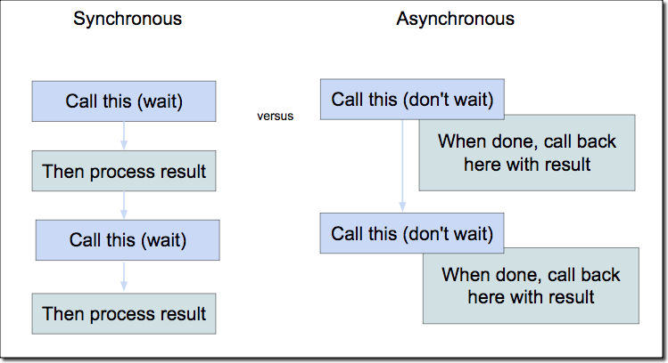

## Introduction

If you are reading this blog to know JS is an async or sync language, you are at the right place. I'm pretty sure after reading this blog, you will remember it your whole life about it. I've seen even experienced developers might get it wrong because of the modern Javascript syntax.

Let us first understand what is synchronous or asynchronous means.

### Synchronous

Synchronous meaning when the code is executed, it is done in line by line fashion. It means the second line will only be executed once the first line is successfully executed. I will be writing a series of blogs on how Javascript works and event loop and all other working parts soon.

Let's take an example of how `sync` code is executed:


```javascript
const arr = [1, 2, 3, 4];
arr.push(5);
console.log(arr) // [1, 2, 3, 4, 5]
```

#### Flow

Step 1: `const arr = [1, 2, 3, 4];`  will be executed first and assign values to the `arr`.

Step 2: `arr.push(5)` will be executed second and push value to the `arr`.

Step 3: print on the console.

All these three statements will be executed sequentially or one by one. I am not adding technical details here on how JS executes them behind the scene, but soon add in a series of blogs.

### Asynchronous

Asynchronous meaning when the code is executed immediately and yields a response in the near future or some point in time ahead of execution. It can notify the caller using the callbacks, promises or an event based paradigm. These days most of the APIs in JS are async based and that's why it feels like JS is async language now.

We can see below how async code is executed in JS:

```
const prom = () => {
    return new Promise((res, rej) => {
        setTimeout(() => (res('Hello World asybc')), 1000);
    });
}
const main = async () => {
  try {
      const res = await prom();
      console.log(res);
  } catch (e) {
      console.log(e);
  }
}

main(); // 'Hello World async' after altest 1 sec
console.log('Hello World sync') // 'Hello World sync' called immediately 
```

#### Flow

We can see there are two functions, one is `main` and another one is `prom`(returns immediately but resolved or reject later in time). 

Step 1: `main()` function starts to call the function definition.

Step 2: we execute `prom()` function, JS knows it has to wait on this line to make sure we receive the value from prom call.

Step 3: In this case, the promise will be returned immediately, but the `res` callback will be called after atlest `1 sec`.

Step 4: `console.log` will be just called after the `main()` as it won't wait for the main to return the result.

I am pretty sure, you might not be following all this at this time if you are new to async programming. But this is how async programming works and it is great for JS as it is single-threaded in nature and improves the User experience or both server and front-end experience.


## Interview Question

1. What will be the o/p of the code?

```
let state = 'ON';
let count = 0;
while (state !== 'OFF') {
   count += 1; 
   console.log(count);
   setTimeout((state = 'OFF'), 1000)
}
```

It keeps the counter up and running because JS is a sync language. How does it happen? Let's know about it.

Step 1: `state` sets to 'ON'.

Step 2: `count` sets to '0'.

Step 3: `while` loop pushed to the stack and we start to execute the first line and keep checking the condition.

Step 4: count is updated to the new value.

Step 5: We logged the value of the count to the console.

Step 6: we call the `setTimeout` web API and it is pushed on the stack and moved to the event loop.

Step 7: Now the partial step 3 to step 5 will be executed continuously without updating the status and why is that?

It is because JS has to first finish all execution on the stack and then check all the cbs from the event loop and in this case, it will never finish the stack operation and there will be an error `ERR_OUT_OF_MEMORY ` or running on Node.js will be different.

2. How to correct the above code?

To make the above code correct you need to make sure that you check the condition on the main thread only.

```
let state = 'ON';
let count = 0;
const currentDate = new Date().getTime();
while (state === 'ON') {
   count += 1; 
   console.log(count);

   if ((new Date().getTime()) - currentDate > 1000) {
       console.log((new Date().getTime()) - currentDate > 1000);
       state = 'OFF';
   } 
}

console.log('I am on main thread too....Don\'t block me');
```

```
const main = async () => {
   try {
       const res = await loop();
       console.log(res);
   } catch (err) {
       console.log(err);
   } 
   
}

const sleep = async () => {
     return new Promise((res, rej) => {
         setTimeout(() => {res('OFF')}, 10000);
     })
}

const loop = async () => {
    let status = "ON";
    let count = 0;
            while (status === 'ON') {
                count += 1;
                console.log(count);
                status = await sleep();  // await works with whil
            }};
```

The main thread consists of the stack and once the stack is completely exhausted JS engine checks the event loop callback queue to push it to the stage for their processing. And in the first question, it will never be going to happen because of the forever while loop. 

However, we made the changes to the second question to make sure why you should desgin your code in such a way that it won't block the main thread.

**Note: If you find any information incorrect or want to update something that you know. Please check my Github repo for the blog and make a contribution to it.**