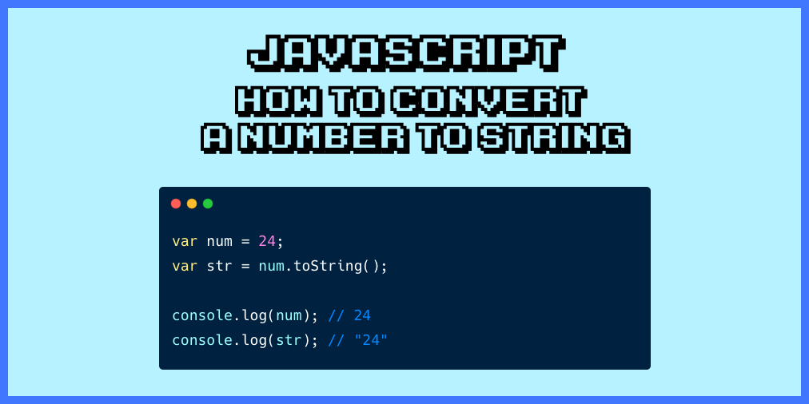

## Introduction



Javascript has many methods and definitely, you can't remember all of them at the same time, but you can learn some of the methods in-depth to gain more hands on it. **toString** is one of the methods we have been using to convert numbers to string (do you think it is the only utility of this method?), converting function definition to string and so on...

This blog will refer to `toString` and how we can use it to convert numbers from one base to another and back to the same state. Getting confused!!! let us take an example of what we are talking about here.

```
const num = 15;
const str = num.toString(2);
console.log(parseInt(str)) 
console.log(parseInt(str, 2)) 
```

So, what are we doing using the toString method? Why the o/p is changed from `'15'` to `'1111'`? Let's first understand the method and we will get back to the o/p of the above code. `toString(radix)` is the method that accepts an optional parameter **radix**. Also, this method is available on all the objects to convert and give the string representation. **radix** is the base from the mathematical number system and the valid values ranges b/w **2 to 32**.

**Note**: using radix only with `numbers` and `bigints` will produce a valid o/p otherwise you will get `NaN`.

This optional parameter defines the base of the number and converts the number to the same base with string representation. So, the o/p of the first log will be `'1111'` (binary representation of 15) and when we parse it to int we get `1111` as a binary number. 

Now, we have a method that converts back string representation to the number and it is available on the Number class. This method also takes an optional parameter radix that represents the base of the string.

```
const obj = {
    fname: "Apoorva",
    lname: "Chikara"
};

console.log(obj.toString()); // [object Object]
```

When you call this method on an object, this is the o/p it produces. And why is that? **Because this is the inherited default value from Object**, you can use it to check or detect the object class.

### Changing the default behaviour

You can override the default behaviour of this method.

```
function Name (fname, lname) {
    this.fname = fanme;
    this.lname = lname;
}

const name = new Name('Apoorva', 'Chikara');
console.log(name.toString()) // [object Object]
```

Now, we can change it to return the custom string.

```
function Name (fname, lname) {
    this.fname = fanme;
    this.lname = lname;
}

const name = new Name('Apoorva', 'Chikara');
console.log(name.toString()) // [object Object]


Name.prototype.toString = function () {
      return `${this.fname} ${this.lname}`;
}

console.log(name.toString()); // "Apoorva Chikara"
```

### Interview Questions

1) How can we find out if an array is an array using  `toString` method?

```
const arr = [1, 2, 3, 4];
Object.prototype.toString.call(arr) // [object Array];
```

2) What is the o/p of below code and why?
```
const object_toString = Object.prototype.toString;
const array_toString = Array.prototype.toString;

const arr = [1, 2, 3];

console.log(object_toString.call(arr1));
console.log(array_toString.call(arr1));
```

The o/p for the first and second line is:

```
[object Array]
1,2,3
```
As we discussed above the default behaviour of the `toString` method is `[object Type]`. In the first o/p, it returns the same and substitutes the type of object that is `Array` in this case.

However, when we run the same method from the Array class, it yields different o/p. The reason is the function definition is modified for array implementation that's why it returns the string representation of array elements by comma separation.


3) What is the difference b/w `JSON.stringify` and `toString`?

`JSON.stringify` is a method from a JSON object that will create a string of the object within the pattern adopted by JSON. It basically serialises an object structure into a string version. Hence, Javascript Object Notation, it will describe an object with all nested structures in pure ASCII string.

For .toString(), a default value is returned when an argument type is an object. JSON.stringify on the other hand returns JSON text, which can be converted back into a JSON object by using JSON.parse.

