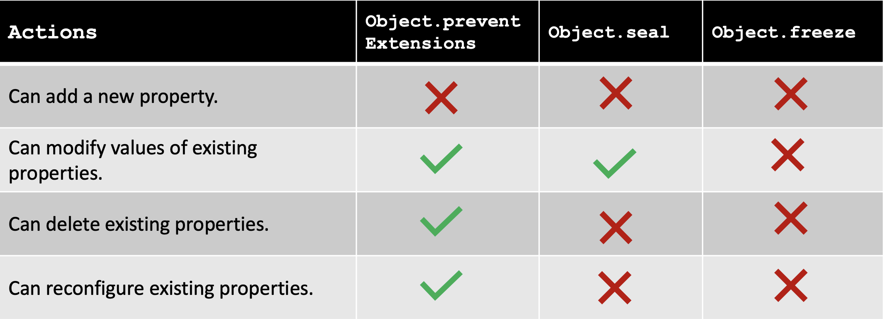

## Introduction



Is everything in JS objects? Yes, almost everything expects primitive types. There are many methods that are available on Objects and these are static methods. 

Well, we might have crossed these methods somewhere while programming or in the interviews. We will go through them one by one and understand `how to use` them, and `when to use them`. 

Every object has properties and they can be configurable, writable and the object itself is extensible i.e you can add/remove new properties. All the methods which we discuss in this blog are used to manipulate these `object property attributes`.

Any object has multiple key-value pairs, each key-value has some metadata that is associated with it and it can be controlled by the below methods.

`enumerable` — Boolean value true/false. If set to true property can be enumerated/listed in loops. Otherwise not.

`configurable` — Boolean value true/false. If set to true property can be reconfigured. Otherwise not.

`writable` — Boolean value true/false. If set to true property can be changed. Otherwise not.

## Object.preventExtensions() ##

As the name suggests, it allows manipulating the extensibility of the given object. In simple terms, when you use this method, it won't allow extending the object i.e adding new properties operation will longer be supported. 

```
const person = {
    name: "Foo",
    address: "Bar"
};

Object.preventExtension(person);
person['newKey'] = "newValue"; // won't allowed
delete person.address; // allowed
person.name = "foo new" // allowed
console.log(person); // {name: 'Foo', address: 'Bar'}
```

The configurable property is set to `false` that won't allow to add new keys to the object, however, you can delete one and you write new values to the existing keys. 

You can check if the object is extensible using `Object.isExtensible()` method, pass the object as the argument.


## Object.seal() ##

This is one level up from the previous method in terms of prohibiting the operation you can do on object. It won't allow to `delete` existing properties, and cannot covert any data property to accessor property.

```
const person = {
    name: "Foo",
    address: "Bar"
};

Object.seal(person);
person['newKey'] = "newValue"; // won't allowed
delete person.address; // won't allowed
person.name = "foo new" // allowed
console.log(person); // {name: 'Foo', address: 'Bar'}
```

Here, you can change the values of existing properties as long as the writable is set to true. You can use `Object.isSealed()` to check if the object is sealed or not.

## Object.freeze() ##

This method restricts everything on the given object. You can't `add/modify/delete` anything on the given object. This sets all the meta properties to `false`.

```
const person = {
    name: "Foo",
    address: "Bar"
};

Object.seal(person);
person['newKey'] = "newValue"; // won't allowed
delete person.address; // won't allowed
person.name = "foo new" // won't allowed
console.log(person); // {name: 'Foo', address: 'Bar'}
```

Also, you can't make any changes to prototype. It will restrict to do anything on the object. 

`Note`: all these operations will throw an error when used in strict mode.

## Interview Questions ##

1) Is const different from Object.freeze?

Yes, `const` is different from `Object.freeze`. `const` does not make the value of the variable immutable, but instead makes the binding of the variable immutable i.e values can't be reassigned but can be updated when referenced.

```
const num = 1;
num = 2 // throw a type error;

const obj = {name: "Apoorva"};
obj.name = "Apoorva Chikara" // will be updated
```

2) Use case of Object.freeze?

When you have fixed-configuration, you fetch the config and freeze it so nobody can change the configuration once set. There can be a lot more.

3) Use case of Object.seal?

When you have a user object and you only want the user to modify the values of the key without modifying the object. For example, you asked users to fill out a form where they can add/delete new information only before they submit it. Once, they submit they can only be able to modify it, you can use it to make sure users won't create any new fields.

## Note ## : feel free to add any questions or update the content on GitHub, it's open-source and merge things on the repo. Once I approve it will be roll-out a new build and update the website.