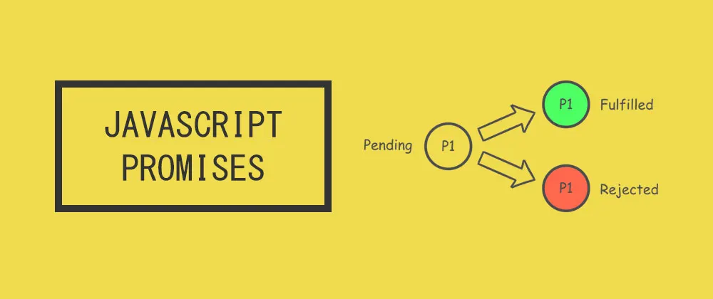

### Introduction

Promise is an object that represents the state of any async operation we perform in our code using it. Once it reaches to one of its state we get the value. We might be already using the promises, but it is always great to see them again what's new with them.

## Definition

In simple terms, it is an object on which we attach the callbacks instead of passing it in the function. It only produces single values in the future and it is successful or failed.

We have been using promises now almost every where. 

## States

Promises have three states Pending, fulfilled and rejected. It must be in one state out of these three. We can methods on promise prototype to check if it is rejected or fulfilled. `then` method is used to check the values returned from promise and `catch` method is chainable that catches any error when promise is in rejected state.

## Usage

Some of you might have already used the promises, you can skip this part may be. The below code snippet creates a promise and how to consume it.

```
function promise () {
    return Promise.resolve('Hello World');
}

const main = () => {
    // access data in the data variable
    promise().then((data) => {
       console.log(data);
    }).catch((e) => {
        // access any errors in this block with e variable
        console.error(e);
    }).finally(() =>{
        console.log('I will be called every time');
    })
} 

main();
```

There are three methods on promise that are used to see the state of the promise - `then`, `catch` and `finally`. `Then` is used to get the results successfully from the promise, `catch` is used to get the errors in the promise and `finally` is used to called whether promise is resolved or rejected.

## When and Why we use them?

Earlier, we used callbacks to make any asynchronous events completion. As soon as they are completed we called them.

```
const main = (cb, a, b,time) => {
    setTimeout(() => {
        cb(a, b);
    }, time)
}

main((a, b) => {
     console.log(a + b); //7
}, 3, 4, 1000)
```

Now, the issues come when we have nested call backs and there is any error. Promises make life easy when you use them.


```

// callback hell example
function first(args, function() {
  secondFunction(args, function() {
    thirdFunction(args, function() {
      // And so on…
    });
  });
});

```
## How to make a simple synchronous code async with promise?

Why I am adding this because I have seen a lot of new comers asked this question. How to make a sync code async in nature? The below code snippet will help you to make any sync code asynchronous. Some people say it an anti-pattern promise creation.

```
const main = () => {
    return new Promise((resolve, reject) => {
         if (true) {
             //here put any success data you want to return
             resolve('data');
         } else {
             reject('error');
         }
    })
}

main().then((data) => {
    console.log(data);
}).catch((e) => {
    console.error(e);
});
```

## Why do we use async-await if we have promises?

Async-await is a syntactic sugar on then/catch. The underlying process is the same as that of promises, it uses then and catch. 

```
const main = () => {
    return Promise.resolve('Hello World');
}

async function getData() {
    try{
        const data = await main();
        console.log(data);
    } catch(e) {
        console.log(e);
    }
    

getData();
```

Advantages it makes the code much cleaner. However, there is no change in the underlying implementation. How JS is interpreting the above code is similar when you write using the then/catch operators.

```
const main = () => {
    return Promise.resolve('Hello World');
}

async function getData() {
    main().then(data => {
        console.log(data);
    }).catch(console.log);
}

getData();   
```

## Interview questions


1) Does promise or async-await blocks the main thread?

No, it is a myth. It doesn't block the main thread instead push things on microqueue in the event loop and once the async task is completed. The callbacks are pushed to the stack again for execution.

```
async function main() {
    try {
         const res = await (an API call);
         console.log(res);
    } catch(e) {
        console.log(e);
    }
}
main();
```
Whenever we put await, it stops the execution of the subsequent code. This is how JS will call the await on won't block the main thread.

```
function main() {
   (an api call).then((res)=>{
       console.log(res);
   }).catch(e => {
       console.log(e);
   })
}
```

2) what is the o/p of below code?

```
const wait = time => new Promise(res => setTimeout(() => res(), time));
// delay of 200ms
wait(200) // called after 200ms
.then(() => new Promise(res => res('foo')))
.then(a => a) 
.then(b => console.log(b)) // foo
.then(() => null)
.then(c => console.log(c)) // null
.then(() => {throw new Error('foo');})
.then(
d => console.log(`d: ${ d }`),
e => console.log(e)) // reason rejection
.then(f => console.log(`f: ${ f }`)) // f: undefined
.catch(e => console.log(e)) 
.then(() => { throw new Error('bar'); })
.then(g => console.log(`g: ${ g }`))
.catch(h => console.log(h)); // Error: bar
```

The wait method will return after 200ms. In the first then, it will return `foo` to the next then handler. It will keep returning until `console.log(b)` - foo. It next then `null` is returned to next then handler and print `null`. Now, the next handler will throw error and the very next handler(then) will print the error message in reason rejection.  

So, instead of calling catch it passing the error to next then handler reason callback. After this next then is called with `console.log(`f: ${ f }`)`. Catch block won't be called as there are no errors and then we throw the error and will be caught in the last catch.


3) How to make custom a promise such that it never rejects?

```
const setPromise = () => {
    return Promise.reject({statusCode: 400});
}

async function promiseNeverRejects(asyncTask) {
        try {
            const res = await asyncTask(); 
            return res;
        } catch(e) {
            return e.statusCode ? `Error: status code ${e.statusCode}`: `Error: e ${e.message}`;
        }
}

function main() {
    promiseNeverRejects(setPromise).then((d) => {
        console.log(`then: ${d}`); // then: Error: status code 400
    }).catch(e => {
        console.log(`catch: ${e}`);
    })
}
```

Note: More methods and details coming soon on promises in Part 2.