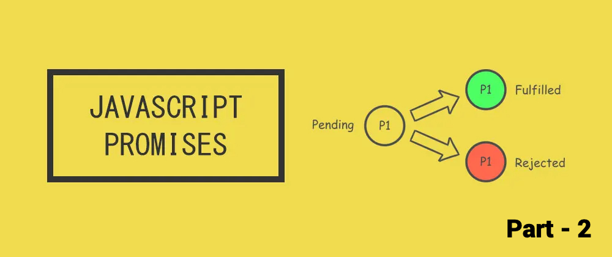

### Introduction

If you want to learn the basics about Promises [check here](/Promise%20and%20async-await/). In the last blog, we understood about basics of promises when to use them, how to make a callback-based function return promise and how to use then/catch as the chainable operators.

In this blog section, we will discuss different methods of promises. We will understand how and when to use them. Here is the list:

-- Promise.all()

-- Promise.allSettled()

-- Promise.any()

-- Promise.race()

I am not including then/catch/finally as we have already discussed them.

#### Promise.all

One of methods developers use extensively for promises. As the name suggest `all` refers to all the promises passed to this function. It returns the single value as resolved or rejected.

##### Syntax
```
Promise.all([promise_1, promise_2 ..., promise_n])
```
##### Example
```
Promise.all([1, 2, 3].map(el => {
    return Promise.resolve().then(() => {
      return el * 2;
    })
})).then(data => {
  // data is an array 
  // you will get the results in same order as 
  // you specify them
  console.log(data); // [2, 4, 6]
})
```

##### Description

You can take multiple promises in an array and pass this array to all methods if all the promises are resolved you can get the data in the thenable method as payload (see in the above code).

If one of the promises is rejected, all the promises will get rejected and you won’t get the expected results. Only those values will be given in the payload until it is not rejected.

##### Use case

If you have some promises and you want to only do something when all of them are successfully resolved.

For example, if you want to bootstrap the application with some configuration needed for the app, you can use it to see all that configuration should be loaded first and then load the app (only for explanation purposes).


#### Promise.allSettled()

It is one of the methods you can use if you want to check rejected and resolved promises together unlike Promise.all that won't show any subsequently resolved promises if one of them is rejected.

##### Syntax
```
Promise.allSettled([1, 2, 3].map((el) => {
      if (el === 2) return Promise.reject(el * 2);
      return Promise.resolve(el* 2);
})).then((data) => {
    console.log(data); // o/p in below code
})
```
It will return the o/p in the same manner, but will include the status of its reason for rejection and if the resolved value will be shared;

O/P
```
0: {status: 'fulfilled', value: 2}
1: {status: 'rejected', reason: 4}
2: {status: 'fulfilled', value: 6}
```

##### Description

You can pass the array to this method and it will return the array in form of result for every promise. It will include the status and reason/value based on promise status as shown above, but it will run for every promise in the array unlike `Promise.all`.

##### Use case

It is useful when you want to keep the code flow running even if some of the promises fail. 

For example, If you have Dashboard and there are multiple microservices for some parts like user details microservice, metrics microservice, andsome other modules microservices. So, you can use allSettled to at least show the dashboard and reload the rejected services again in the view. 

This won't hinder the user experience in loading the UI view.

#### Promise.any()

It is useful when you need to start any process as soon as one of the promises is resolved or when all the promises are rejected with an AggregateError.

##### Syntax
```
Promise.any([1, 2, 3].map((el) => {
      if (el === 2) return Promise.reject(el * 2);
      return Promise.resolve(el* 2);
})).then((data) => {
    console.log(data); // 2
})
```

##### Description
In the above code, it will return the value of the first resolved promise i.e even if the previous promises are rejected it will still return the first resolved promise.

##### Use case

Useful when you are only dependent on the first resolve of your promises.

For example, You can use it in the dashboard where you can show the data for any service once you receive the data and others can be placed to retry logic.

#### Promise.race()
It is useful as soon as one of the iterable promises is resolved or rejected i.e the first one in the array of promises that is fulfilled or rejected.

##### Syntax
```
const prom1 = new Promise((resolve, reject) => {
  setTimeout(resolve, 500, 'one');
});

const prom2 = new Promise((resolve, reject) => {
  setTimeout(resolve, 100, 'two');
});

Promise.race([prom1, prom2]).then((value) => {
  console.log(value); // prom2 will be resolved faster
```

##### Description

In the above code, we passed two promises in the race method and `prom2` will be resolved first as it is called on the stack after atleast 100ms. The o/p will be the fastest resolved.

##### Use case

It is useful when you want to check and load a module in the application as soon as you received data for that particular module.

## Interview Questions

1) Can we use async-await and then/catch together?

No, we can’t use async/await is just syntactic sugar on then/catch. I have seen many people use them together, but we shouldn’t do it.

Some developers do this:

```
const prom = () =>  Promise.resolve('Hello World');
// Node v16
// high level await
await prom().then(console.log).catch(console.log);
}
```

You don't need to mix them, it behaves very differently as we expect. Instead, use the below pattern;

```
const prom = () =>  Promise.resolve('Hello World');
// Node v16
// high level await
try {
    const response = await prom();
} catch(e) {
    console.log(e);
}

// lower version of node
function main() {
   prom().then(data => {
       console.log(data);
   }).catch(e => {
       console.log(e);
   })
}

main();
```

2) Should we use a promise constructor to return the values?

No, As you can't leverage the promise chain if you use it. Check [here](https://stackoverflow.com/questions/23803743/what-is-the-explicit-promise-construction-antipattern-and-how-do-i-avoid-it).

You can simply use the async keyword with your function. It will automatically wrap the response in the promise and send it to the calling function.
```
function main() {
    called().then((data) => {
         console.log(data);
    }).catch(console.error);
}

async function called() {
    return 'Hello World';
}

main();
```

3) What is the o/p of the below code?

```
const  promises = [Promise.resolve('Hello World'), Promise.resolve('Hello World 2')];
const output = Promise.race(promises);
console.log(output)
})
```

The answer will be `Pending state` and why? Because of its asynchronous nature, you will see the output as a `pending state`. immediately logging the value of o/p won't return anything as it has not been updated yet. 

Once the stack is empty, it will push the resolved promises back to the stack and populate its values.

```
const  promises = [Promise.resolve('Hello World'), Promise.resolve('Hello World 2')];
const output = Promise.race(promises);
console.log(output);

setTimeout(() => {
console.log(output);
}, 0)
```