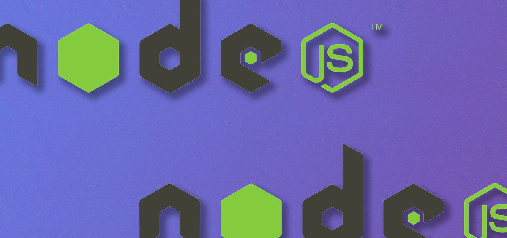

## Introduction

`node:` is a new protocol import for loading the Node.js built-in or native modules. Most of the developers haven't heard or read about it including me. So, I thought to provide information on it and it can be used in our on-going or upcoming project. 

I will be including all the **Node.js versions** it will be supported in. Before moving onto that let's take a look at how to use it first:

```
import * as fs from 'fs'; // generally we use this way to import the built-in modules
```

```
import * as fs from 'node:fs' // it will make sure that the native or a built-in module is loaded
```

## Why do we need it?

The most important benefit that it can prove is a developer can tell by looking at the code whether this is a built-in module or a third-party. Not everyone remembers the name of all `built-in` modules, but it can help you decide what module is not a core module. 

It reduces the list of a module present in the **node_modules** overriding the newer imports. Also, makes the import identifier a `valid absolute URL`.

It is also important if Node adds the new module with the same name, the built-in module won't be overridden.

## Supported Node.js Versions

    - v16.0.0, v14.18.0 (ESM import and CommonJS require())
    - v14.13.1, v12.20.0
    - Supported in TypeScript by the latest versions of @types/node(>= v16.0.0)

**Note: You can check out the Node.js documentation for more details <a href="https://nodejs.org/api/esm.html#urls" target="_blank">here</a>!!**